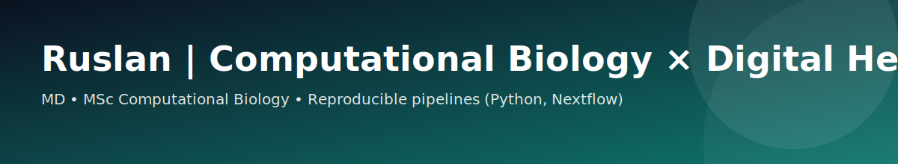

  

<h2 align="center">Ruslan | Computational Biology × Digital Health</h2>

  Medical Doctor & MSc in Computational Biology building reproducible, privacy-aware analytics pipelines in Python/Nextflow.
  

  <a href="https://www.linkedin.com/in/ruslankurmashev/">LinkedIn</a> •
  <a href="https://orcid.org/0009-0006-7588-5319">ORCID</a> •
  <a href="mailto:ruslankurmasev0@gmail.com">Email</a>

---

## Focus
- Reproducible bioinformatics and data science pipelines
- Clinical data review and audit-ready documentation (GDPR, ICH-GCP awareness)
- Microbiome (16S) analytics and applied ML

## Tech stack
Python: pandas, NumPy, scikit-learn, PyTorch  
Nextflow • Docker • Bash
